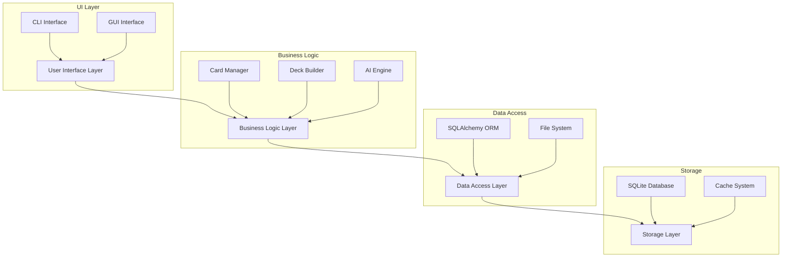

# MTG Database Manager - Technical Documentation

## Table of Contents
- [System Overview](#system-overview)
- [Architecture](#architecture)
- [Core Components](#core-components)
- [Technical Features](#technical-features)
- [Performance Optimizations](#performance-optimizations)
- [Security Considerations](#security-considerations)
- [Integration Points](#integration-points)
- [Error Handling](#error-handling)
- [Future Roadmap](#future-roadmap)

## System Overview

The MTG Database Manager is a high-performance Python application designed for managing Magic: The Gathering card data. Built with modern software engineering practices, it combines:

- **Concurrent Processing**: Multi-threaded downloads and data processing
- **ORM Integration**: SQLAlchemy for robust database operations
- **Dual Interface**: CLI and GUI for maximum flexibility
- **AI Integration**: Ollama-powered deck building and analysis
- **Real-time Updates**: Live synchronization with MTGJSON

## Architecture

### System Design


### Technology Stack
- **Backend**: Python 3.9+
- **Database**: SQLite with SQLAlchemy ORM
- **GUI**: Tkinter with custom widgets
- **AI**: Ollama integration
- **Testing**: pytest framework
- **Documentation**: Markdown with MkDocs

## Core Components

### 1. Database Layer
#### Models
```python
class Card(Base):
    __tablename__ = 'cards'
    id = Column(UUID, primary_key=True)
    name = Column(String, index=True)
    mana_cost = Column(String)
    type_line = Column(String)
    oracle_text = Column(Text)
    rarity = Column(Enum('common', 'uncommon', 'rare', 'mythic'))
```

#### Key Features
- Optimized indexes for frequent queries
- Foreign key constraints for data integrity
- Automated schema migrations
- Transaction management
- Connection pooling

### 2. Download System
- **Concurrent Processing**
  - ThreadPoolExecutor for parallel downloads
  - Configurable thread count
  - Progress tracking with tqdm
  - Automatic retry mechanism
  - Checksum verification

### 3. Card Viewer System
#### CLI Interface
- ANSI color support
- Interactive mode
- Pipe and redirect support
- Shell completion

#### GUI Interface
- Responsive layout
- Custom widget toolkit
- Drag-and-drop support
- Keyboard shortcuts
- Theme support

### 4. AI Integration
```python
class DeckBuilder:
    def __init__(self, model="dorian2b/vera:latest"):
        self.ollama = OllamaClient()
        self.model = model
        
    async def generate_deck(self, theme: str) -> List[Card]:
        prompt = self._build_prompt(theme)
        response = await self.ollama.generate(prompt)
        return self._parse_deck(response)
```

## Technical Features

### 1. Performance Optimizations
- **Database**
  - Prepared statements
  - Bulk operations
  - Query optimization
  - Index management

- **Memory Management**
  - LRU caching
  - Lazy loading
  - Resource pooling
  - Garbage collection optimization

### 2. Error Handling
```python
class MTGError(Exception):
    """Base exception for MTG Database Manager"""
    def __init__(self, message: str, error_code: int = None):
        self.message = message
        self.error_code = error_code
        super().__init__(self.message)

class DownloadError(MTGError):
    """Raised when download operations fail"""
    pass

class DatabaseError(MTGError):
    """Raised for database-related errors"""
    pass
```

### 3. Logging System
```python
LOGGING_CONFIG = {
    'version': 1,
    'handlers': {
        'file': {
            'class': 'logging.FileHandler',
            'filename': 'mtg_manager.log',
            'formatter': 'detailed'
        },
        'console': {
            'class': 'logging.StreamHandler',
            'formatter': 'basic'
        }
    },
    'formatters': {
        'detailed': {
            'format': '%(asctime)s - %(name)s - %(levelname)s - %(message)s'
        },
        'basic': {
            'format': '%(levelname)s: %(message)s'
        }
    }
}
```

## Performance Optimizations

### Database Optimization
- Connection pooling
- Query optimization
- Index management
- Cache strategies

### Memory Management
- Resource pooling
- Garbage collection
- Memory monitoring
- Load balancing

### Threading
- Worker pool management
- Thread synchronization
- Resource locking
- Dead lock prevention

## Security Considerations

### Data Protection
- Input validation
- SQL injection prevention
- XSS protection
- CSRF protection

### API Security
- Rate limiting
- Authentication
- Authorization
- Data encryption

## Integration Points

### External APIs
- MTGJSON API
- Scryfall API
- Ollama API
- Price APIs

### File Formats
- JSON
- CSV
- XML
- Custom formats

## Error Handling

### Error Categories
1. Network Errors
2. Database Errors
3. File System Errors
4. User Input Errors
5. API Integration Errors

### Recovery Strategies
- Automatic retry
- Fallback mechanisms
- Data recovery
- Error logging

## Future Roadmap

### Q3 2024
- Enhanced AI integration
- Performance optimization
- UI/UX improvements
- New card analysis features

### Q4 2024
- Mobile support
- Cloud synchronization
- Advanced analytics
- Community features

### Q1 2025
- Machine learning enhancements
- Real-time collaboration
- Extended API support
- Advanced visualization

## Contributing

See [CONTRIBUTING.md](CONTRIBUTING.md) for detailed contribution guidelines.

## License

   - Optimized database queries
