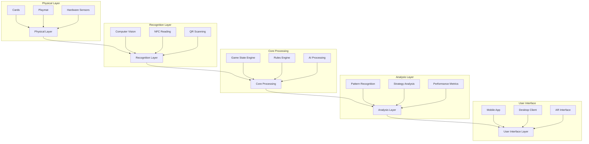
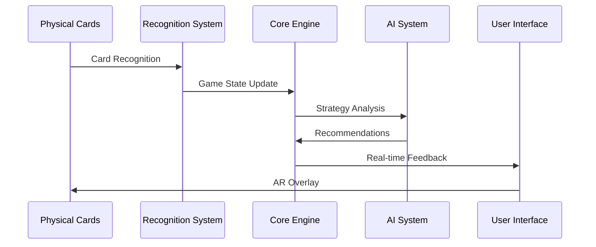
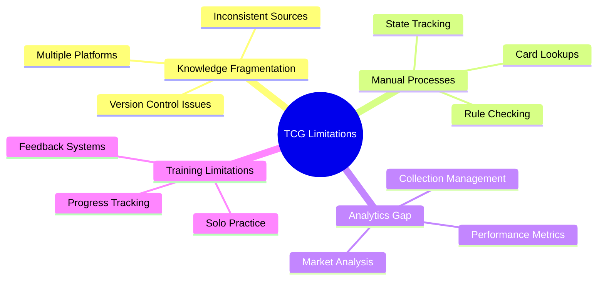
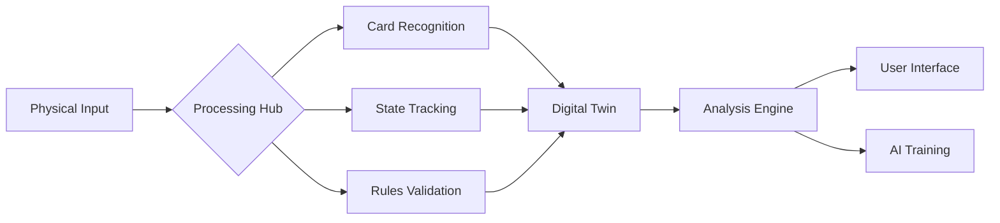
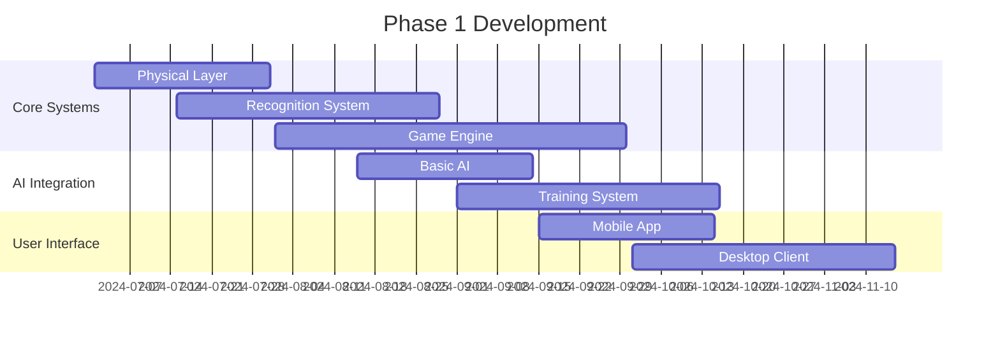

# MTG Nexus: Bridging Physical and Digital TCG Mastery


A revolutionary toolkit connecting physical TCG gameplay with advanced digital training systems. Designed for Magic: The Gathering® players seeking to transcend traditional skill ceilings through data-driven mastery.

## System Architecture Overview

### Core System Components


### Data Flow Architecture


## The Physical-Digital Divide

### Current Ecosystem Limitations


## Core Infrastructure

### Data Processing Pipeline


## Technical Implementation

### System Components
1. **Physical Layer**
   - NFC-enabled cards
   - Smart playmat with embedded sensors
   - Computer vision integration
   - Biometric sensors

2. **Recognition System**
   - Real-time card detection
   - Game state tracking
   - Player action recognition
   - Environmental analysis

3. **Core Engine**
   - Rule enforcement
   - State management
   - Event processing
   - Data synchronization

4. **AI System**
   - Strategy analysis
   - Pattern recognition
   - Deck optimization
   - Performance prediction

### Code Architecture
```python
class NexusCore:
    def __init__(self):
        self.physical_layer = PhysicalLayer()
        self.recognition = RecognitionSystem()
        self.game_engine = GameEngine()
        self.ai_system = AISystem()
        
    async def process_game_state(self, state: GameState):
        physical_input = await self.physical_layer.get_input()
        recognized_state = self.recognition.process(physical_input)
        game_update = self.game_engine.update(recognized_state)
        ai_analysis = await self.ai_system.analyze(game_update)
        return self.generate_feedback(ai_analysis)
```

## Development Roadmap

### Phase 1: Foundation (Q3 2024)


### Phase 2: Advanced Features (Q4 2024)
- Neural network enhancements
- Advanced pattern recognition
- Real-time strategy assistance
- Community features integration

### Phase 3: Innovation (Q1 2025)
- Full AR integration
- Advanced biometrics
- Machine learning optimization
- Global tournament support

## Technical Requirements

### Hardware Specifications
```yaml
minimum_requirements:
  processor: "Quad-core 2.5GHz"
  memory: "8GB RAM"
  storage: "256GB SSD"
  camera: "1080p 30fps"
  network: "5GHz WiFi"

recommended_requirements:
  processor: "Octa-core 3.5GHz"
  memory: "16GB RAM"
  storage: "512GB NVMe"
  camera: "4K 60fps"
  network: "WiFi 6E"
```

### Software Dependencies
```python
requirements = {
    'core': [
        'python>=3.9',
        'tensorflow>=2.8',
        'opencv-python>=4.6',
        'numpy>=1.22',
    ],
    'ui': [
        'qt6>=6.2',
        'pygame>=2.1',
        'kivy>=2.1',
    ],
    'networking': [
        'asyncio>=3.4',
        'websockets>=10.0',
        'grpcio>=1.44',
    ]
}
```

## Contributing Guidelines

### Development Areas
| Component | Expertise Required | Priority |
|-----------|-------------------|-----------|
| Core Engine | Python, C++ | High |
| AI Systems | TensorFlow, PyTorch | High |
| Mobile App | Flutter, React Native | Medium |
| AR Systems | Unity, Vuforia | Medium |
| Hardware | Embedded Systems | Low |

## License and Legal

### Licensing Structure
- Core Engine: MIT License
- Hardware Designs: Creative Commons
- AI Models: Proprietary License
- User Data: GDPR Compliant

## Contact and Support

### Community Resources
- Documentation: [docs.mtgnexus.com](https://docs.mtgnexus.com)
- Discord: [discord.gg/mtgnexus](https://discord.gg/mtgnexus)
- GitHub: [github.com/mtgnexus](https://github.com/mtgnexus)
- Support: support@mtgnexus.com

---

*"Bridging the gap between physical and digital Magic: The Gathering gameplay through innovative technology and data-driven insights."*