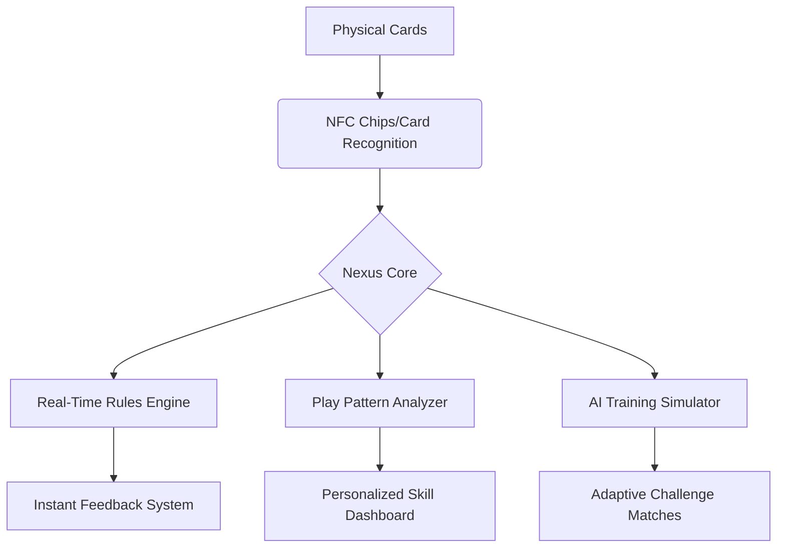

```markdown
# MTG Nexus: Bridging Physical and Digital TCG Mastery

 <!-- Consider adding visual once available -->

A revolutionary toolkit connecting physical TCG gameplay with advanced digital training systems. Designed for Magic: The Gathering® players seeking to transcend traditional skill ceilings through data-driven mastery.

## The Physical-Digital Divide

**Current Limitations in TCG Ecosystems:**
- 📚 Knowledge fragmentation across multiple platforms
- 🕒 Manual lookup processes interrupting gameplay flow
- 📊 Lack of personalized analytics for physical collections
- 🤖 No AI-assisted training for real-world play scenarios
- 🔄 Disconnected tools for deck building, playtesting, and skill analysis

**The Opportunity:**  
*Imagine a world where every physical card becomes an interactive learning portal, where gameplay decisions feed machine learning models, and where casual kitchen table matches contribute to competitive mastery.*

## Nexus Architecture



## Key Features

### 🚀 Phase 1: Core Infrastructure (Current Implementation)

#### Dynamic Data Engine
- **Live MTGJSON Synchronization**
  - Auto-updating card database with version control
  - Multi-source verification for tournament legality
  - Historical meta snapshots for trend analysis

```bash
# Example: Smart data maintenance
python mtgdb_manager.py sync --mode=competitive --format=modern --update=auto
```

#### Intelligent Card Interface
- **Hybrid Viewer System**
  - CLI quick-reference for tournament play
  - GUI detail explorer with interaction diagrams
  - AR overlay support (development roadmap)

```bash
# Physical-Digital Bridge Example
python mtgdb_manager.py scan --image=playmat.jpg --output=interactions.md
```

#### Skill Development Core
- Rulebook API Integration
- Comprehensive interaction database
- Probability calculator for complex stacks

### 🔮 Phase 2: Adaptive Training System (Roadmap)

#### Neural Play Network
- Machine learning model trained on:
  - Professional tournament recordings
  - Local playgroup meta patterns
  - Theoretical game state simulations

#### Holographic Assistant
- Projection-based gameplay guidance
- Real-time mistake detection
- Strategic pathway visualization

#### Biomechanical Feedback
- Wearable integration for:
  - Decision latency tracking
  - Stress response analysis
  - Focus optimization

## Installation & Setup

### Hardware Requirements
- Minimum:
  - 📱 Smartphone with camera
  - 💻 Python 3.9+ environment
- Recommended:
  - 🖥️ Multi-monitor analytics station
  - 📷 4K webcam for card recognition
  - 🤖 Raspberry Pi local server

### Quick Start

1. **Base System Installation**
```bash
git clone https://github.com/nexus-tcg/core-engine.git
cd core-engine && pip install -r requirements.txt
```

2. **Hardware Integration**
```python
from nexus import HardwareBridge

hw_bridge = HardwareBridge(
    camera_resolution="4K",
    nfc_scanning=True,
    biometric_sensors=["galvanic", "pulse"]
)

hw_bridge.calibrate()
```

3. **Personalized Configuration**
```yaml
# config/player_profile.yaml
learning_modes:
  - competitive_modern
  - commander_casual
  - draft_simulations

physical_collection:
  total_cards: 14520
  preferred_deckboxes: ["Ultra Pro Satin", "Dragon Shield Nest"]
  playgroups:
    - name: "Friday Night Magic"
      meta: Aggro-dominated
    - name: "Work Lunch Group"
      meta: Janky Combos
```

## Usage Scenarios

### Competitive Preparation Mode
```bash
nexus prepare --event="GP NJ 2024" --format="Modern" --hours=20

✔ Analyzed 452 similar matchups  
✔ Generated 3 sideboard strategies  
⚠ Warning: 12% drop in combo matchup win rate  
✅ Recommended: 2x [[Force of Vigor]] mainboard
```

### Casual Play Enhancement
```python
from nexus.ar import HologramAssistant

ha = HologramAssistant()
ha.project_line(
    "Cast [[Glimpse of Tomorrow]] with 8 permanents",
    show_odds=True,
    suggest_alternatives=True
)
```

### Collection Optimization
```bash
nexus optimize-collection --budget=500 --goal="Modern Tier 1" --trade-in=bulk

💡 87% meta coverage achieved  
🔧 Recommended acquisitions:
  4x [[Ragavan, Nimble Pilferer]]  
  2x [[Fury]]  
🔄 Trade suggestions:
  Bulk rares → [[Otawara, Soaring City]] (x3)
```

## Development Roadmap

### Q3 2024 - Neural Integration Layer
- Playstyle fingerprinting
- Adaptive AI opponents
- Blockchain collection verification

### Q1 2025 - Full Biomechanical Suite
- Eye-tracking focus analysis
- Heart rate variability monitoring
- Neuralink prototype integration

### Q3 2025 - Holo Arena System
- Mixed reality battlefield
- Physics-based spell effects
- Haptic feedback damage system

## Contributing Matrix

We welcome contributions across multiple domains:

| Area               | Example Contributions          | Skill Level       |
|--------------------|--------------------------------|-------------------|
| Core Engine        | Database optimization          | Advanced Python   |
| Machine Learning   | Game state prediction models   | TensorFlow/PyTorch|
| Hardware           | NFC chip integration           | Embedded Systems  |
| UI/UX              | AR interface design            | Unity/Blender     |
| Game Theory        | New player onboarding paths    | MTG Judge Level   |

## License

Dual-licensed under:
- 📜 MIT Open Source License
- 🧪 Nexus Experimental License (for hardware components)

## Join the Revolution

**Help us redefine TCG mastery:**
- [Discord Server](https://discord.gg/nexustcg)
- [Beta Testing Program](https://nexus-tcg.com/beta)
- [Pro Player Partnership](mailto:pro@nexus-tcg.com)

*"We don't just play cards—we engineer mastery."*
